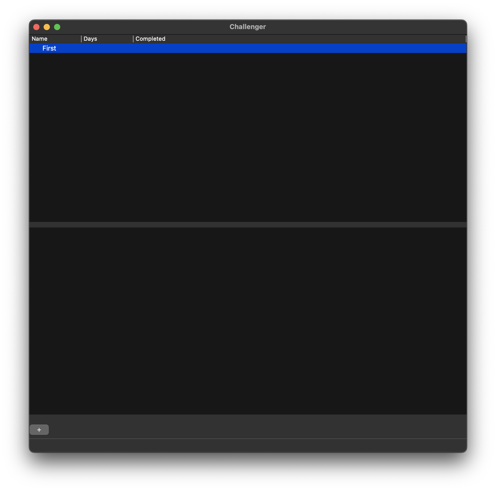
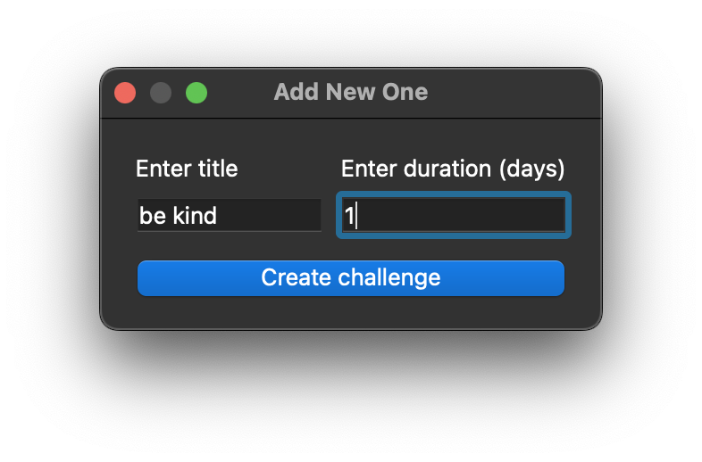
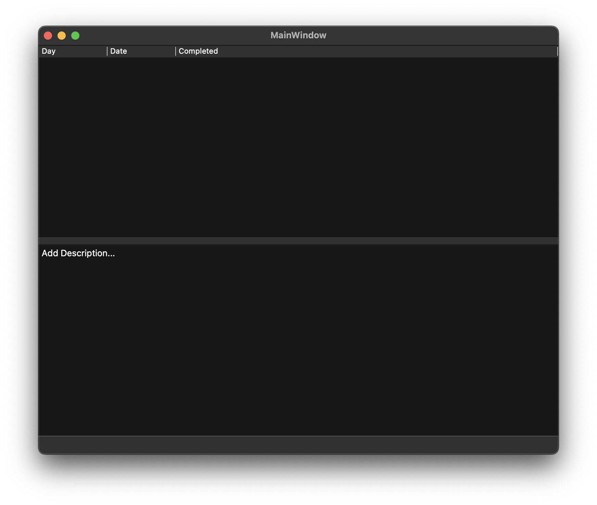

[](https://www.python.org/downloads/)

# 📝Челлендж Трекер
## О проекте:
- Данный проект помогает пользователю составлять собственные челленджи, отследивать  прогресс, а также делать пометки по каждому из них.
- Кол-во строк кода: 314
- Также можно ознакомится с [__Технической спецификацией__](materials/technical_specification.md)
- [**__Ссылка на запись работы проекта__**](https://disk.yandex.ru/i/_SeEq8V6zzPh9g)

---
## 📌Зависимости
Прежде, чем начать, убедитесь, что у вас установлено следующее:
- [Python](https://www.python.org/downloads/) версии 3.11 или 3.12
---


## 🧱Установка
Вы можете клонировать [**репозиторий**](https://github.com/RomkaGP228/challanger_analyzer.git) на вашу систему и установить неоходимые зависимости:
```shell
~ >>> git clone https://github.com/RomkaGP228/challanger_analyzer.git
~ >>> cd challanger_analyzer

# Linux
~/challanger_analyzer >>> python3 -m venv venv
~/challanger_analyzer >>> source venv/bin/activate
~/challanger_analyzer >>> pip3 install -r requirements.txt
~/challanger_analyzer >>> python3 main.py

# Windows
~/challanger_analyzer >>> python -m venv venv
~/challanger_analyzer >>> venv\Scripts\activate
~/challanger_analyzer >>> pip install -r requirements.txt
~/challanger_analyzer >>> python main.py
```
---
## О работе проекта
>Для создания требуется ввести всего  название нового челленджа и его длительность в диалоговом окне.
>


>Также юзер может отмечать выполнение по каждому дню и делать пометки.
>


>Также есть множество разных Диалоговых (всплывающих) окон:\
> [1](materials/Dialog1.png) [2](materials/Dialog2.png) [3](materials/Dialog3.png) [4](materials/Dialog4.png) [5](materials/Dialog5.png) [6](materials/Dialog6.png)

