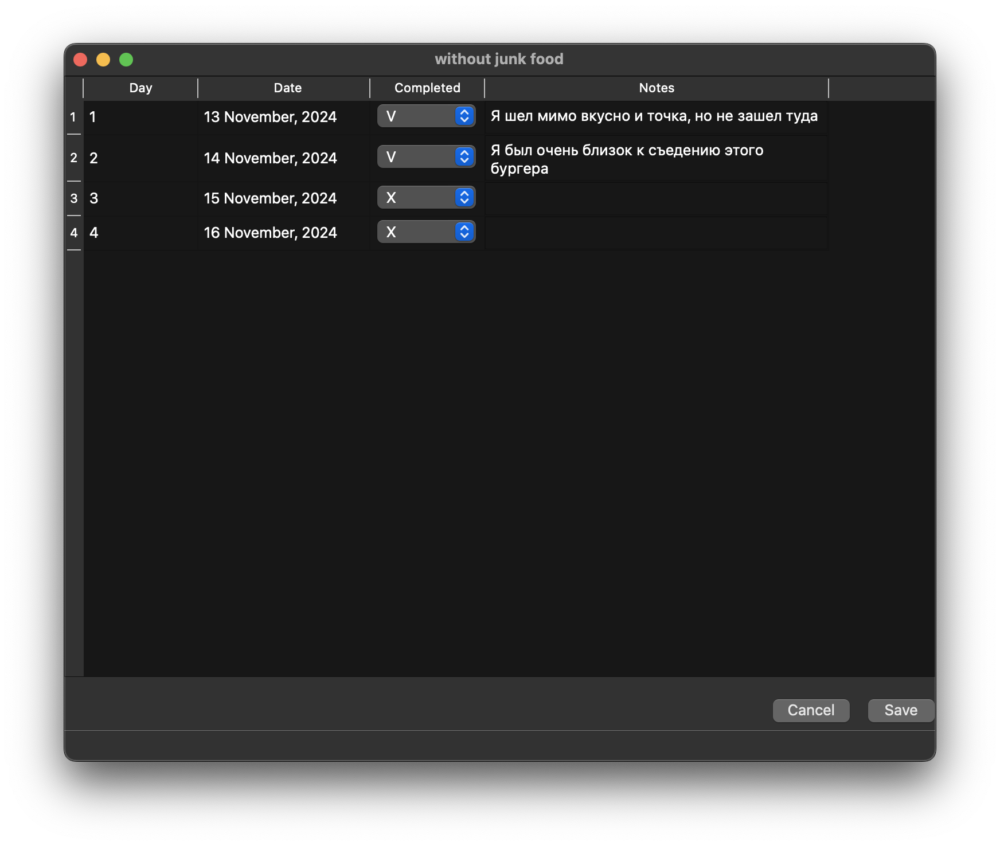
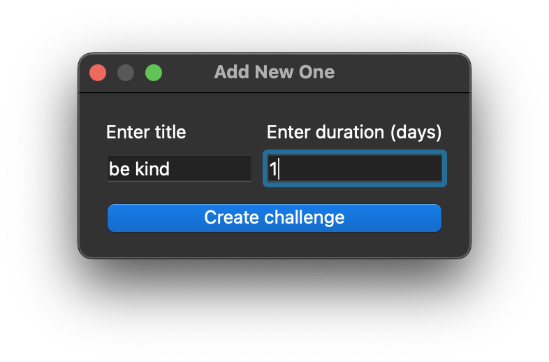

1. Project Name: __Челлендж Трекер__
2. Авторы:
    - Разработчик: Кулаков Роман Антонович
    - Ментор и учитель: Анатольев Алексей Владимирович
3. Description of the program:
   - Что будет делать программа:
       > Программа для записи и хранения челледжей, которые пользователь сможет отслеживать и делать пометки по конкретным дням
   - Запуск программы:
       > Прямо после запуска пользователь видит таблицу со своими челленджами формате: Название, длительность, выполнено
     
   - Необходимые формы:
       > - Главная форма с таблицей
       > - Форма с днями в челлендже
       > - Форма добавления нового челленджа
       
   - Виджеты для форм:
       > - QTreeWidget
       > - QTableWidget
       > - QWidgetAction
       > - QDialog
       > - QComboBox
       > - QTextEdit
       > - QMainWindow
       > - QMessageBox
   - Диалоговые окна:
       > - Диалоговое окно создания нового челленджа
       > - Диалоговые окна с вопросами
       
   - Необходимые файлы: 
       > - Файл JSON с пометкой по каждому дню
   - Организация базы данных: 
       > - БД с информацией о каждом челлендже
   - Структура и объем данных в базе данных: 
       > Необходимо создать таблицу в БД
       > - Название челленджа
       > - Дата создания
       > - Дата окончания
       > - Длительность
       > - Кол-во выполненных дней
       > - информация(название json файла, который относится к этому челленджу)
   - Выход из программы:
       > Программа просто закрывается
       > Запрос о сохранении данных происходит при закрытии окна с информацией о челлендже